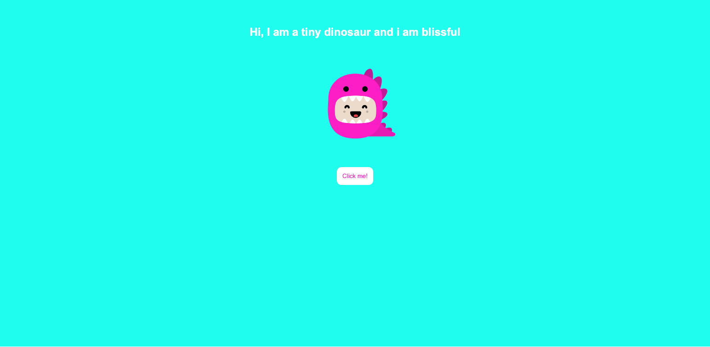

# Tiny Dinosaur Mood App

This is a simple React application that displays a cute tiny dinosaur with different moods. You can change the dinosaur's mood by clicking a button.

## Demo

Check out the live demo [here](https://tiny-dino-mood.netlify.app/).

## Screenshot

## Features

- Displays a tiny dinosaur with various moods
- Changes the dinosaur's mood randomly when the button is clicked

## Technologies Used

- React
- TypeScript
- [React Kawaii](https://react-kawaii.now.sh/) for the dinosaur component

## Installation

1. Clone the repository:
   git clone https://github.com/your-username/tiny-dinosaur-mood.git
   cd tiny-dinosaur-mood
2. Install the dependencies:
   npm install

3. Start the development server:
   npm start

4. Open your browser and navigate to http://localhost:3000.

## Usage

Once the application is running, you will see a tiny dinosaur with a default mood.
Click the "Click me!" button to change the dinosaur's mood randomly
